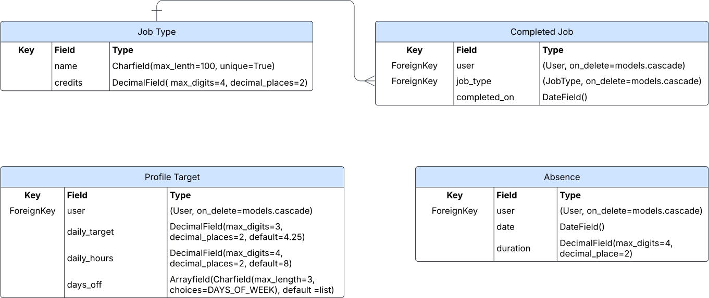

# CTrack

[view live site](https://ctrack-app-7613567699ef.herokuapp.com/)
## UX/UI
### Project Goals
The primary goal of CTrack is to provide a clean and intuitive app for users to track their performance.
CTrack has one main target audience: Engineer colleagues from my current role.

#### User Goals:
The main goal for the user is to be able to track their performance effortlessly. No guess work or spreadsheets, just a clear understanding of where they stand each day of the week.  
The engineer has a daily target that should be achieved. This target is an amount of credits and the engineer earns credits when completing jobs.

#### Business Goals:
Since targets are adjusted with any absences, each job type is allocated a different amount of credits, and these credits are based on decimals of an hour, it can get very tricky for the engineer to track accurately their performance.
When using Ctrack the engineer can effortlessly track and understand their current metrics.  
CTrack allows the user to:  
* Log completed job.
* Record any absences.
* Modify their daily target, shift hours and rostered days off.
* Dynamically adjust their daily target if any absences.
* Understand at a glance where they stand each day.  

### Design Choices

Since this is a business focused app for internal use only, the user interface was designed to be functional. More time was put into the user experience, making sure that all main functions were only two clicks away from any part of the site once logged in.  

The app was designed for mobile phone screens first, having in mind the engineers since they would primarily use it from their work phones. Then it was adapted to be responsive for larger screens using bootstrap’s grid properties.

#### Main Page (Tracker)
This page was designed to display the main data and user interaction, which is completing job form submissions. This is the page that engineers will look at every working day so it holds all the data they need to know where they stand each day.

#### Fonts
Both main fonts were imported from Google fonts.
* Roboto as the primary font for most of the body items.
* Nunito as the secondary font for headings and lead text.

#### Colour palette
The colour palette was chosen from coolors.co and then adjusted for adequate contrast.
* Primary colour: #27545D
* Secondary Colour: #022B3A
* Highlight Colour: #BFDBF7
* Highlight Colour Light: #F0F0F0

### User Stories

1. As a Site Admin I can create, read, update and delete job types so that site users can accurately track their performance by selecting specific job options.

    * Given a logged in super user, they can create a job type.
    * Given a logged in super user, they can read a job type.
    * iven a logged in super user, they can update a job type.
    * Given a logged in super user, they can delete a job type.

2. As a Site User I can register an account so that I can submit and save my performance data.

    * Given a site user, they can submit a sign up form to register an account.

3. As a Site User I can add my completed job types so that I can track my performance.

    * Given a logged in user, they can select from a list of different job types

4. As a Site User I can modify or delete completed jobs so that I can correct mistaken inputs.

    * Given a logged in user, they can modify their completed job types.
    * Given a logged in user, they can delete their completed job types.

5. As a Site User I can record, modify or delete absences so that my target is adjusted.

    * Given a logged in user, they can create an absence.
    * Given a logged in user, they can modify their absences.
    * Given a logged in user, they can delete their absences.

6. As a Site User I need easy navigation and a user-friendly design, so I can find information quickly and efficiently without frustration.

    * The website is fully responsive across different screen sizes.
    * Site layout and navigation are intuitive.

7. As a Site User I can modify my shift hours and rostered days so that my target is adjusted correctly.

    * Given a logged in user, they can modify their shift hours.
    * Given a logged in user, they can modify their rostered days.
    * Given a logged in user, they can modify their standard target.

8. As a Site User I can see the benefits from using the website's features so I can decide to use the site or not.

    * The website has an about section dedicated to explaining the site's features.

## Features
### Existing Features
User Authentication:
Engineers can create an account and login to have access to the main functions. This way all the data is saved and filtered so the user can only see and modify what's theirs. 
User authentication is handled by the allauth python package.
#### Getting Started
Getting started is very simple, you only need to follow these two steps:  
* Create an account in the register page.
* Adjust your Profile settings if needed. (Daily target, weekly hours and rostered days off).

You can now start logging your completed jobs in the Tracker section. Any absences can be recorded in the absence page and this will automatically adjust your target for the day. If you wish to modify a job that you have already submitted this can be done in the job history page.

### Features Left to Implement
In future deployments I would like to implement these features: 

#### PWA functionality:
Giving the user the option to download a version of the website that would feel as a native app. Allowing the user to have certain features even when off line.

#### Productivity Chart:
Giving the user a visual representation of their current performance metrics.

#### About Us section:
Allowing the site admin to modify the home/about section through the admin page. As it stands this page is coded with all the content in the template making it only possible for a developer to modify.

## Technologies Used
**Framework:** Django.  
**Front-end:** Javascript, CSS, HTML and Bootstrap.  
**Back-end:** Python and PostgreSQL database.  
**Version Control:** Git & github.  
**Deployment:** The site is deployed on Heroku.

## Database ERD

## Testing
### Manual Testing
For the UX all main features were designed to be 2 clicks away from any part of the site once logged in.  
All forms were manually tested for:
* Correct value input (email, name, numbers…).
* Submit buttons working.
* Feedback when submitted properly.
* Warnings before deleting any data. 

### Automatic Testing
#### W3C Markup Validation
All pages were tested with W3C markup validator with no major error. The only errors were on the Sign Up and Absence page forms. This is due to using crispy forms.

#### W3C CSS Validation
This tested with no errors.

#### JSLint
All JS documents were tested with no major errors. The only errors were due to  JSLint not liking for loops not nested in functions.

#### Pep8
All python documents were tested to meet pep8 standards.  

#### Google Lighthouse
All pages were tested with lighthouse for performance, accessibility and best practice. The app consistently scored over 80, 95 and 100 respectively.  
The only warning was for insufficient contrast of the Delete button's background and foreground. This was tested again with [webaim.org](https://webaim.org/resources/contrastchecker/) and passed for graphical objects and user interface components.

With more time and in future deployments I would like to use Unit tests for the main functions of each app.

## Credits
The colour palette was chosen from [coolors.co](https://coolors.co/).  
The fonts were imported from [Google fonts](https://fonts.google.com/).  
All icons were imported from [fontawesome.com](https://fontawesome.com/).  
The favicon was created with [favicon.io](https://favicon.io/).  
